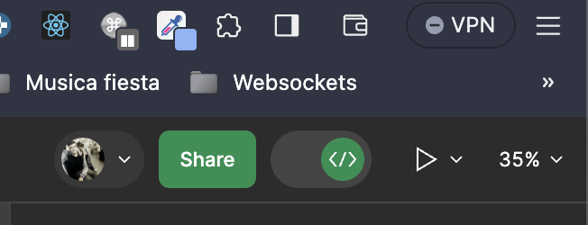

# Prueba técnica

El objetivo de esta prueba es conocer un poco mejor cómo trabajas, las buenas prácticas que sigues y tu atención por el
detalle. Valoraremos la sencillez, facilidad para entender el código y la robustez.
Aspectos que nos facilitan asegurar la calidad, revisar, modificar y mantener el código.

Para realizar el ejercicio te proporcionaremos un proyecto inicial de react en el que debes crear el diseño publicado en
este enlace de figma

[Figma](https://www.figma.com/file/rUw71oRzI6UfR7CaiE06CJ/Test-Figma?type=design&node-id=2%3A5&mode=design&t=qkQfEvMTWvGIuRjD-1)

Para poder habilitar el modo dev tienes que crear una cuenta en figma. Puedes usar el login social si te parece más sencillo.

Tienes que activar el interruptor que se encuentra a la derecha de "Share"

Cuando inicies la prueba técnica debes crearte un nuevo repositorio en github y pasarnos el enlace
al correo <a href="mailto:dev@uelzpay.com">dev@uelzpay.com</a>. Tambien nos puedes mandar una invitación a tu repositorio a tecnologia@uelzpay.com y a irene@uelzpay.com

Te sugerimos que empieces implementando la mecánica básica del ejercicio y posteriormente añadas los detalles y mejoras
que consideres, de esta manera tendrás algo revisable aunque se te acabe el tiempo.

Se van a valorar todas las buenas prácticas que conozcas, pero no pierdas el foco de entregar un proyecto con un juego
funcional. También se valorará el uso que hagas de git, ramas, estilo de los commits, etc.

Valoraremos positivamente que hagas uso de tailwind para la parte visual y que uses react query en algún punto de la prueba

## Descripción del ejercicio

Se trata de implementar un juego clásico; el memory. La mecánica es bastante sencilla:

Al empezar la partida tienes una parrilla de tarjetas vistas del reverso. Las tarjetas contienen una serie de parejas de
imágenes que se colocan de forma aleatoria en cada tirada. Puedes descubrir dos tarjetas a la vez:

* Si las tarjetas son iguales se quedan descubiertas.
* Si las tarjetas son distintas se vuelven a poner del reverso para
  que sigas buscando parejas.
* El juego termina cuando hayas revelado todas las parejas.

## Pasos para preparar el entorno para realizar la prueba

1) Es necesario tener instalado node >= 10 y yarn.
2) Clonas este repo
3) Ejecutas "yarn" en la carpeta del proyecto
4) Ejecutas "yarn start" para comenzar a desarrollar en http://localhost:3000
